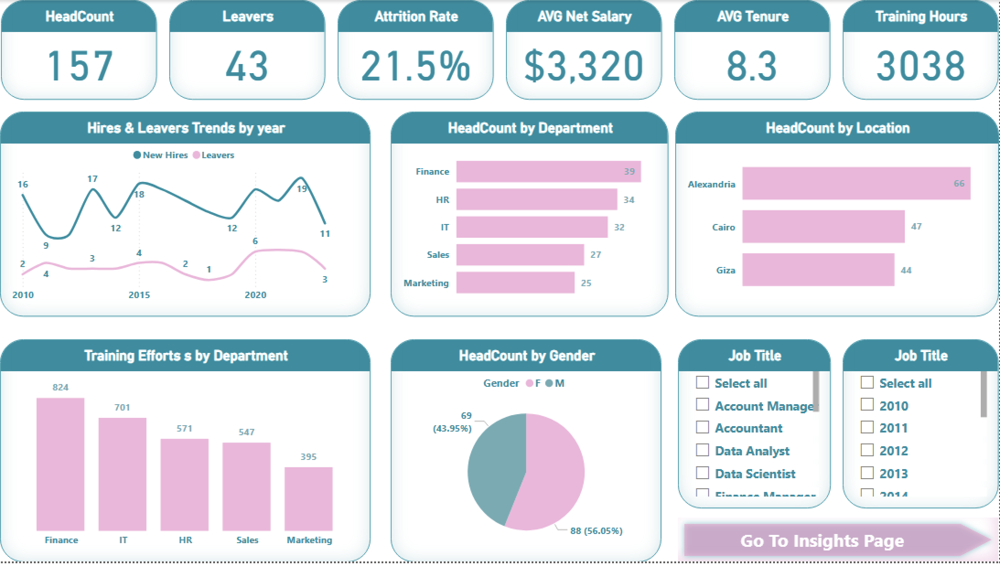
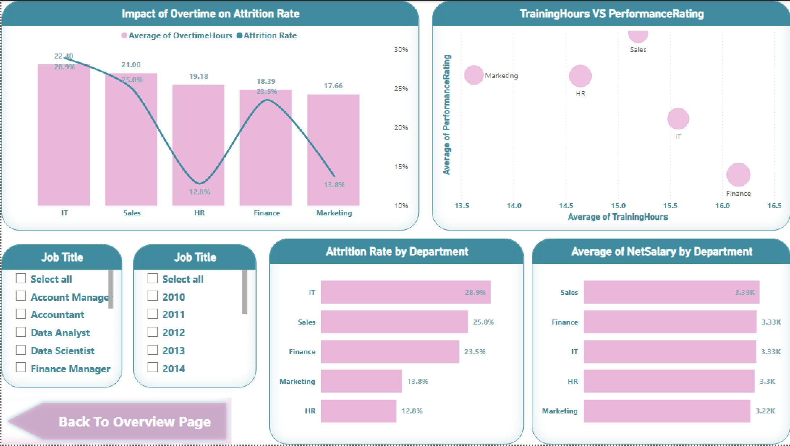

# 💼 HR Analytics Dashboard – Power BI  

### 🎓 Task from **Egypt Data Builders Bootcamp** with **Eng. Ali Ashraf**  

---

## 🖼️ Dashboard Previews  

**HR Overview Page**

**HR Insights Page**

---

## 🧭 Project Overview  
This Power BI project focuses on analyzing HR data to uncover insights about employee headcount, attrition, salary trends, and performance.  
The goal was to provide HR managers with a clear and interactive view of workforce dynamics and retention patterns.

---

## 🧹 Data Preparation  
- Cleaned and validated data for accuracy.  
- Merged two main tables: **Employees** and **Salary Details**.  
- Fixed date, salary, and department inconsistencies.  
- Added calculated columns and DAX measures for analysis.

---

## 🧩 Data Modeling  
- Built a one-to-one relationship between tables using *Employee ID*.  
- Created custom DAX measures for KPIs:  
  - 🧍‍♂️ **Headcount**  
  - 🚪 **Leavers**  
  - 📉 **Attrition Rate**  
  - 💰 **Average Net Salary**  
  - ⏳ **Average Tenure**  
  - 🎓 **Training Hours**

---

## 📊 Dashboard Pages  

### 1️⃣ HR Overview Dashboard 👥  
- **KPI Cards:** Headcount, Leavers, Attrition Rate, Avg Net Salary, Avg Tenure, Training Hours  
- **Visuals:**  
  - Hires vs Leavers by Year *(Line Chart)*  
  - Headcount by Department *(Bar Chart)*  
  - Headcount by Gender *(Pie Chart)*  
  - Headcount by Location *(Column Chart)*  
  - Training Hours by Department *(Column Chart)*  

---

### 2️⃣ HR Insights Dashboard 💡  
- **Visuals:**  
  - Attrition Rate by Department *(Column Chart)*  
  - AVG of Net Salary by Department *(Bar Chart)*  
  - Overtime Hours vs Attrition Type *(Combo Chart – Line + Column)*  
  - Performance Rating vs Training Hours *(Scatter Chart)*  
- **Extras:**  
  - Page navigation buttons  
  - Slicers for Department, Gender, and Year  

---

## 🧠 Key Insights  
- Departments with more overtime showed higher attrition.  
- Training hours correlated positively with performance.  
- Salary gaps between departments highlighted potential retention risks.  
- Balanced gender distribution across most departments.  

---

## ⚙️ Tools & Technologies  
- 🟡 **Power BI**  
- 📗 **Power Query**  
- 🔢 **DAX (Data Analysis Expressions)**  
- 🧮 **Data Modeling**

---

